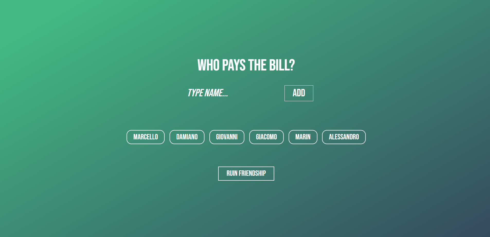

# WHO PAYS THE BILL APP

Hi everyone my name is Marcello Pascolini and i develop this simple app using Vue.js via CDN during my Udemy classes.

## Introduction

I built this simple app with purpose of ruining friendships...nah, i'm just joking.
I used @event and :property binding to manage the data flow, you can simply:
- Add names 
- After that you added at least 2 names you can start play
- You can remove names from the list by simply clicking them
- The random function will pick up 1 random name from the list...THE LOOSER
- Once you have done, you can play again

## Technologies

I used Vue3 and base CSS3 to apply stylesheets

## Layout

